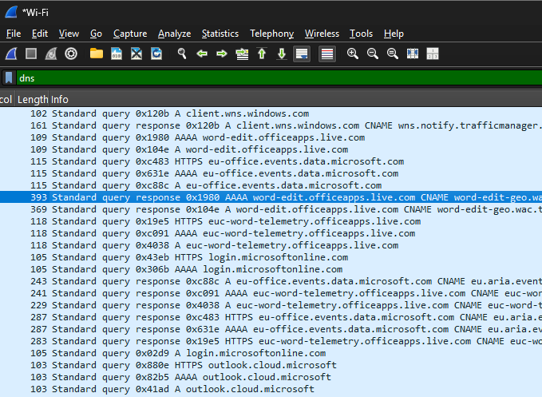
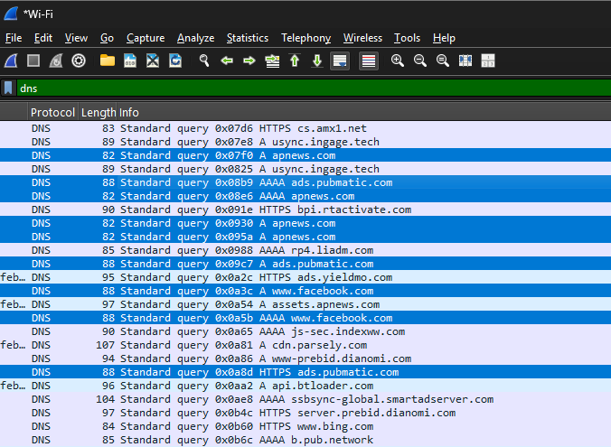
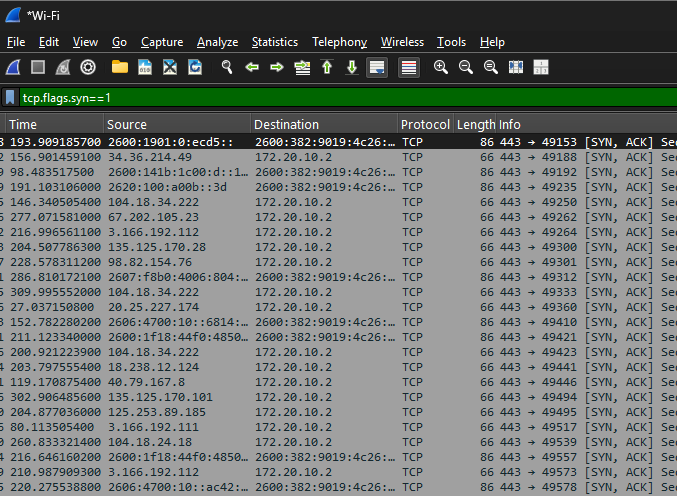
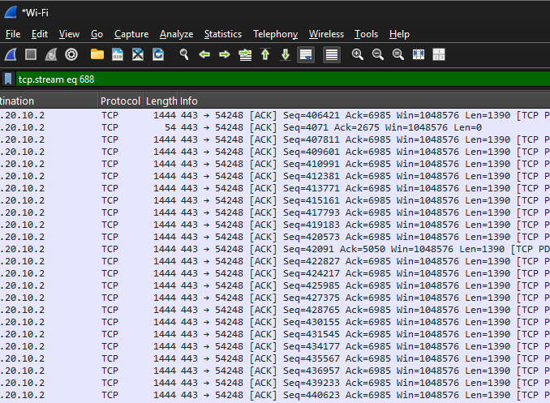
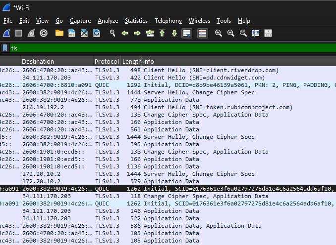

# network-threat-hunting
This project focuses on analyzing network traffic from a security perspective to identify patterns that could indicate suspicious or potentially malicious activity. Using Wireshark, traffic was captured and examined to understand how normal network behavior can sometimes resemble threat activity.

The goal of this project was not to detect confirmed malware, but to develop the ability to recognize patterns, interpret network behavior, and think like a SOC analyst.

---

## Tools Used
- Wireshark
- Web browser (traffic generation)

---

## Methodology
A live packet capture was conducted on an active network interface. Traffic was intentionally generated by:
- Visiting multiple websites
- Opening several browser tabs in quick succession
- Repeatedly refreshing pages
- Allowing background traffic to run

This approach created a mix of normal and repeated behaviors, enabling analysis of patterns that may appear suspicious in certain contexts.

Filters used during analysis:
- `dns`
- `tcp.flags.syn == 1`
- `tls`

---

## Findings

### Finding 1: Repeated DNS Requests
During analysis, multiple DNS queries were observed for the same domain within a short time frame. This indicates repeated attempts to resolve the same hostname.

This behavior is commonly seen in normal web browsing due to page refreshes, background services, or multiple resources being loaded from the same domain. However, similar patterns can also be associated with automated processes or beaconing behavior in malicious scenarios.

This finding highlights the importance of context when analyzing DNS traffic, as both normal and potentially suspicious activities can produce similar patterns.

---

### Finding 2: Frequent TCP Connection Activity
A high volume of TCP packets containing SYN and SYN-ACK flags was observed, indicating frequent connection attempts between the client and multiple external servers.

This behavior is typical for modern web activity, where a single webpage may establish multiple connections simultaneously to load content efficiently. However, similar patterns may also appear during network scanning or automated connection attempts in malicious scenarios.

This demonstrates how normal network behavior can resemble suspicious activity, reinforcing the need for deeper analysis in real-world investigations.

---

### Finding 3: Encrypted Network Communication
When analyzing TCP streams, the captured data appeared unreadable and encrypted. Further inspection confirmed the presence of TLS traffic, indicating that the communication was secured using encryption protocols.

This is consistent with modern web practices, where HTTPS is widely used to protect user data. While encryption enhances security, it also limits visibility into the contents of network traffic, which can make threat detection more challenging without additional tools.

This finding emphasizes the balance between privacy and security monitoring in modern networks.

---

## Screenshots

### DNS Analysis
  

---

### TCP Activity
  

---

### TLS Analysis

---

## Key Takeaways
- Network behavior can appear suspicious even when it is legitimate
- Repeated DNS requests may indicate normal activity or automated behavior
- High volumes of TCP connections are common in modern web applications
- Most traffic is encrypted, limiting direct visibility into data
- Context is critical when determining whether activity is malicious

---

## Conclusion
This project demonstrates how analyzing network traffic from a security perspective requires more than simply identifying packets. It involves understanding patterns, interpreting behavior, and recognizing that normal activity can sometimes resemble potential threats.

By applying a threat-hunting mindset, this analysis highlights the importance of context and reinforces the role of analysts in distinguishing between benign and suspicious activity.

---

## Future Work
This project focused on identifying patterns in network traffic that could resemble suspicious activity. While it provided insight into how analysts interpret network behavior, the next step is to build a more controlled environment for deeper security analysis.

Moving forward, I plan to develop a personal cybersecurity homelab to simulate network activity, test defensive strategies, and analyze traffic in a more structured setting. This will allow for a deeper understanding of threat detection, system monitoring, and real-world security operations.
